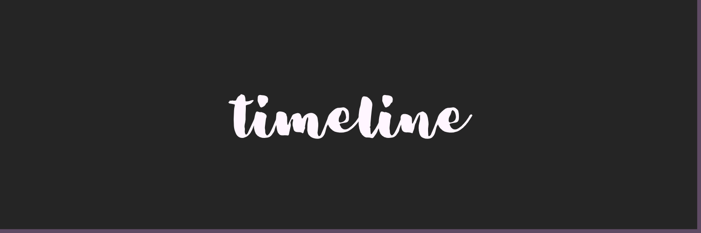

# 

Esse repositório contém datas que foram importantes para mim em minha carreira, então aqui você não vai encontrar todas as coisas que já produzi, caso queira conferir TODA a minha timeline é só [clicar aqui](https://timeline.levxyca.com/).

## 🖱️

- [2020](#2020)
- [2021](#2021)
- [2022](#2022)

## 2020

🎓 Comecei a cursar Análise e Desenvolvimento de Sistemas na Universidade Tecnológica Federal do Paraná no segundo semestre de 2019.

📚 No ínicio de 2020, despertou meu interesse por front-end e comecei a estudar sobre as bases: web design, html e css.

🔴 Comecei com live coding dia 7 de junho de 2020.

⭐ Em julho fui Co-fundadora da 'Live Coder Girls', atual '[Feministech](https://www.twitch.tv/team/livecodergirls)'.

🗣 No segundo semestre de 2020 tive minhas primeiras partipações em podcasts e entrevistas.

- Entrevista no canal da [Little Yuuh](https://www.twitch.tv/little_yuuh) sobre como é ser iniciante na área de TI
-  18/12 Podcast Start Coding, Episódio sobre [Como é atuar no cenário de Stream?](https://open.spotify.com/episode/3u3gDFEPzWTjRnJ4G86l7I)
- Participação no !chamaeu, um quadro de entrevista do canal do [pokemaobr](https://www.twitch.tv/pokemaobr) falando sobre como começar em TI

✍🏻 Em 01/10 postei o meu primeiro artigo falando sobre [github para leigos](https://dev.to/levxyca/pt-br-github-para-leigos-4i7j).

💻 Em outubro de 2020 participei da minha primeira hacktoberfest!

## 2021

🎙️ No dia 6 de janeiro de 2021 criamos o podcast [Moças da Web](https://anchor.fm/mocasdaweb), um podcast com bate-papo sobre tecnologia apresentado por mim e pela [Pachi Codes](https://pachicodes.com).

🎥 Dia 23 de janeiro postei o meu [primeiro vídeo](https://www.youtube.com/watch?v=D0Y8AJ6oMn0&lc=UgyGfJuyZECbzDwvpWZ4AaABAg) no youtube!

🎥 Dia 4 de fevereiro eu consegui bater os meus primeiros 100 inscritos no youtube! Agora meu canal tem link personalizado.

💼 Dia 8 de março me tornei oficialmente uma estágiária em desenvolvimento web.

🎙️ 21 de abril participei do podcast 'Mlks da Deepweb', atual 'Mlkda da Deepweb'. [Falei sobre carreira de front-end](https://open.spotify.com/episode/4JAYwqjCTBc2q5M7lrCA5G?si=yA24NhiiQuehirHNYL_KnA&dl_branch=1&nd=1).

🎙️ 04 de junho participei do podcast 'Feministech'. [Apresentei e falei sobre a Karen Jones](https://anchor.fm/feministech/episodes/Levxyca-apresenta-Karen-Jones---Episdio-0-7-e11ksak/a-a5mij8a).

🎙️ 19 de junho participei do podcast 'Feministech' falando sobre [HTML semântico](https://anchor.fm/feministech/episodes/conhecendo-html-semntico-com-levxyca---Episdio-2-e120svi).

🔴 Completei 1 ano de live coding dia 7 de junho de 2021.

💼 12 de junho finalizei o meu estágio obrigatório em desenvolvimento web.

🔴 9 de agosto meu canal do twitch teve sua primeira parceria, uma ação com a EBAC.

🗣 No dia 18 de setembro, fui Mestre de Cerimônia da Sala de Conteúdo Sonia Guimarães, trilha sobre Front-end, na PrograMaria Summit 2021.

🗣 Dia 25 de setembro dei minha primeira palestra no RanchoDev na trila Midday falando sobre "Como live coding pode te ajudar sendo uma pessoa iniciante na área de TI".

🌸 1 de novembro comecei a minha participação no projeto de mentoria da Feministech com foco em HTML && CSS para mulheres e pessoas não binárias.

⭐ 19 de novembro me tornei uma GitHub Star.

## 2022

💼 5 de abril me tornei Tech Community Manager da Abacatinhos.dev

🗣 8 de abril realizei minha primeira palestra técnica falando sobre: A importância da acessibilidade e como introduzir isso para dentro dos nossos projetos com HTML.

👑 19 de maio selecionada para ser embaixadora da @WomenTechmakers.

💵 8 de junho meu perfil foi aprovado no GitHub Sponsors.

💼 4 de julho entrei na Jera como desenvolvedora de software.

✈️ Participei do meu primeiro evento tech presencial com a RubyConf Brasil.
